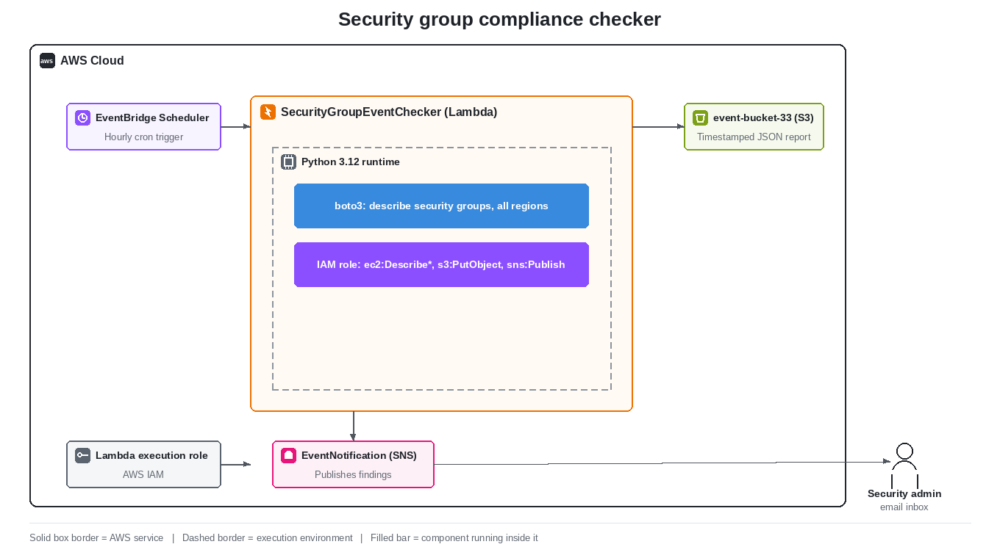

# AWS Security Group Compliance Checker

An automated, serverless compliance monitoring system that scans AWS Security Groups across all regions for public access rules, stores audit reports in Amazon S3, and sends real-time email alerts via Amazon SNS.

## Overview

This project demonstrates a fully serverless, event-driven architecture that runs on a schedule and audits AWS Security Groups for compliance violations. The system identifies security groups with any inbound rule open to `0.0.0.0/0` (the public internet), generates a JSON audit report, stores it in S3 with a timestamped filename, and emails the findings to the administrator via SNS.

## Architecture



**Flow:** EventBridge Scheduler triggers the Lambda function hourly. Lambda scans all AWS regions for public security group rules, stores a timestamped JSON report in S3, and publishes the findings to SNS, which emails the security admin.

## AWS Services Used

| Service | Purpose |
| :--- | :--- |
| Amazon EventBridge Scheduler | Triggers the Lambda function every hour via cron |
| AWS Lambda | Scans security groups and generates compliance reports |
| Amazon S3 | Stores JSON audit reports with timestamped filenames |
| Amazon SNS | Sends email notifications with compliance findings |
| AWS IAM | Grants Lambda permissions to access S3, SNS, and EC2 |

## How It Works

1. EventBridge Scheduler fires the Lambda function on a cron schedule
2. Lambda uses the boto3 SDK to list all AWS regions and scan each one
3. It identifies security groups with inbound rules where the source is 0.0.0.0/0
4. The findings are formatted as JSON and stored in S3 with a timestamped filename
5. The findings are also published to an SNS topic
6. SNS delivers an email notification to the subscribed address

## Example Output

S3 audit file (security-audit-2026-09-23-15-28-47.json):

```json
[
  {
    "Region": "eu-north-1",
    "SecurityGroupId": "sg-03beee4151c84daa9",
    "Port": 22,
    "Protocol": "tcp"
  }
]
